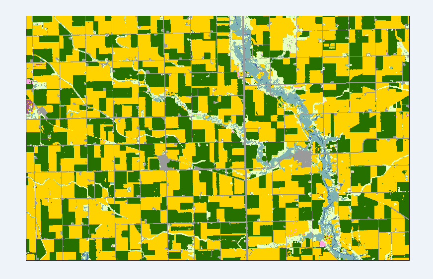

<h3>Extract Cropland Data Layer (CDL) file for a specific bounding box and year</h3>

<h4>This python code queries NAAS Geodata API for given bounding box and year and retrives Cropland image in TIF format</h4>

```
Get CDL file using following ways 
1. By Year and FIPS/ASD code
2. By Year and Bounding BOX
3. By Year and multiple points
4. By Year and upload vector files (shp file in zip format)

```


[Click here for the API examples](https://nassgeodata.gmu.edu/CropScape/devhelp/help.html)


*We can get crop land  statistics , CDL stats comparison for 2 years (in json,CSV formats), extract cropland values using crop categories and generate PDF*


```python
import requests

def CDL_clip_retrieve(bbox="130783,2203171,153923,2217961", year=2018):
    """
    Retrieve a Cropland Data Layer (CDL) file for a specific bounding box and year.

    Args:
    bbox (str): Bounding box coordinates in the format "minx,miny,maxx,maxy".
    year (int): The year for which to retrieve the CDL data.

    Returns:
    bytes: The content of the retrieved TIFF file.
    """
    # Make the request to retrieve the CDL file
    url = 'https://nassgeodata.gmu.edu/axis2/services/CDLService/GetCDLFile'
    params = {
        'year': year,
        'bbox': bbox
    }
    
    try:
        response = requests.get(url, params=params)
        response.raise_for_status()  # Raise an exception for bad status codes
        
        # Process the response to obtain the CDL file URL
        cdl_file_url = response.content.decode('utf-8').split('<returnURL>')[1].split('</returnURL>')[0]
        print(f"CDL file URL: {cdl_file_url}")
        
        # Retrieve the actual TIFF file
        tiff_response = requests.get(cdl_file_url)
        tiff_response.raise_for_status()
        
        return tiff_response.content  # tif_bytes
    
    except requests.exceptions.RequestException as e:
        print(f"An error occurred: {e}")
        return None

# Example usage
if __name__ == "__main__":
    bbox = "130783,2203171,153923,2217961"
    year = 2019
    
    tif_data = CDL_clip_retrieve(bbox, year)
    
    if tif_data:
        # Save the TIFF file
        with open(f"cdl_data_{year}.tif", "wb") as f:
            f.write(tif_data)
        print(f"CDL data for year {year} has been saved as 'cdl_data_{year}.tif'")
    else:
        print("Failed to retrieve CDL data")
```

             

  


