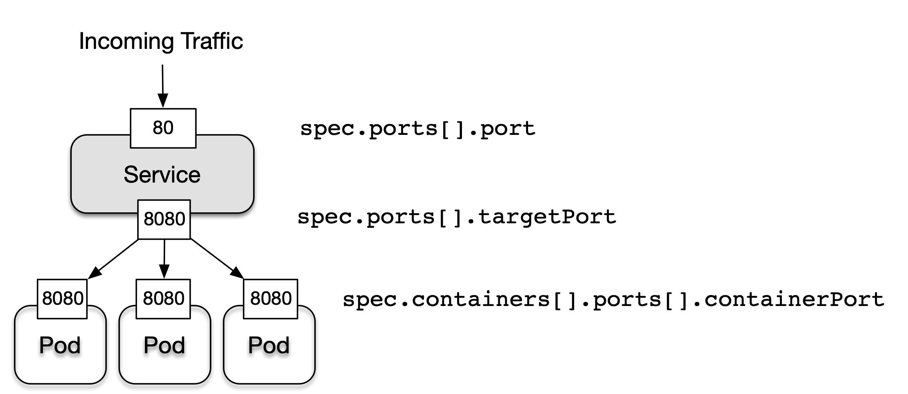

### Few Tips :

1.  Whenever config-map is updated, you need to manually restart the services to update the changes
2.  Ephemeral Volumes exist for the lifespan of a Pod.  Persistent Volumes preserve data beyond the lifespan of a Pod.
3.  Volume Types 
     -  emptyDir - Empty directory in Pod with read/write access. Only persisted for the lifespan of a Pod. A good choice for cache implementations or data exchange between containers of a Pod.
     - hostPath:  File or directory from the host node’s filesystem. Supported only on single-node clusters and not meant for production.
     - configMap , Secrets: Provides a way to inject configuration data.
     - nfs: An existing NFS (Network File System) share. Preserves data after Pod restart.
     - persistentVolumeClaim : Claims a Persistent Volume. 
     
4. Create a multi-container (easy way )
   
     ```shell script
       kubectl run multipod --image=nginx --dry-run=client -o yaml>multipod.yaml
       kubectl run beta --image=busybox -- command sleep 4800 --dry-run=client -o yaml>>multipod.yaml
    ```
    
    vi multipod.yaml
    - Podname: multipod (containers; alpha & beta)
    - update first container name:line 11 –> name: alpha
    - delete below 13-lines (from line-12 onwards)
    - you are good now to apply the yaml file.
    - kubectl describe po multipod

5. Debug the distroless container 
    
    ```shell script  
       # debian is container image ,fyi 
       kubectl debug <pod-name> exec -it --image=busybox --target=debian        
    ```
6. Revisit some docker commands 

    ```shell script  
     # Docker build image
    docker build -t  image-name:version . 
  
     # runs container in background and does port forward to 8080      
    docker run -d -p 8080:8080  image-name:version

       # login to container shell     
    docker exec -it <container-id> bash
    
    docker tag image-name:version  username/name

    docker save -o <file-name.extensions>  image-name:version

    docker load --input <file-name.extension>
        
    ```
7. ***Init containers*** provide initialization logic concerns to be run before the main application even starts.

8. The init container sets up a configuration file in the directory /usr/shared/app. This directory has been shared through a Volume so that it can be referenced by a Node.js-based application running in the main container.

```yml
    apiVersion: v1
    kind: Pod
    metadata:
      name: web-app
    spec:
      initContainers:
      - name: configurer
        image: busybox:1.36.1
        command: ['sh', '-c', 'echo Configuring application... && \
                  mkdir -p /usr/shared/app && echo -e "{\"dbConfig\": \
                  {\"host\":\"localhost\",\"port\":5432,\"dbName\":\"customers\"}}" \
                  > /usr/shared/app/config.json']
        volumeMounts:
        - name: configdir
          mountPath: "/usr/shared/app"
      containers:
      - image: iamlaksh1/web-app:1.0.0
        name: web
        ports:
        - containerPort: 8080
        volumeMounts:
        - name: configdir
          mountPath: "/usr/shared/app"
      volumes:
      - name: configdir
        emptyDir: {}
```

9. Create labels on POD 

 ``` shell script 
     kubectl run labeled-pod --image=nginx:1.25.1  --labels=tier=backend,env=dev
     kubectl get pods -l 'team in (shiny, legacy)' --show-labels   #searching 
```

10.  **Label selection as part of network-selection API**

```YAML 
    apiVersion: networking.k8s.io/v1
    kind: NetworkPolicy
    metadata:
      name: frontend-network-policy
    spec:
      podSelector:
        matchLabels:
          tier: frontend
```

11.  The mapping between the Deployment and the replicas it controls happens through label selection.For label selection to work properly, the assignment of ***spec.selector.matchLabels*** and ***spec.template.metadata*** needs to match

12. **Health Check Attributes**

| Attributes | Default Value  | Description
  | --- | --- |  --- |   
| initialDelaySeconds            | 0 |  Delay in seconds until first check is executed.   
| periodSeconds                  | 10 |  Interval for executing a check (e.g., every 20 seconds).   
| timeoutSeconds                | 1 |  Maximum number of seconds until check operation times out.
| successThreshold                | 10 |  Number of successful check attempts until probe is considered successful after a failure.
| failureThreshold                | 3 |  Number of failures for check attempts before probe is marked failed and takes action   
| terminationGracePeriodSeconds   | 30 |  Grace period before forcing a container to stop upon failure. 

12. Network policies can be aggregated. A default deny rule may disallow ingress and/or egress traffic. An additional network policy can open up those rules with a more fine-grained definition.


13. **Service Port Mapping**
 

14. 