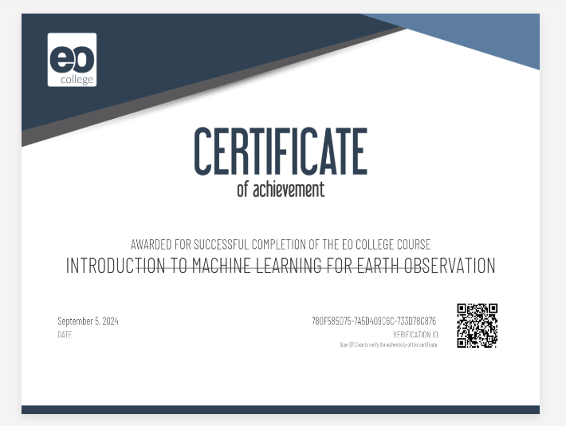

    
    
  ```This is an engaging course on Machine Learning for Earth Observation. This certification program covers the following seven topics, each with a well-designed quiz at the end.```

- Artificial Intelligence and Data Science in Earth Observation
- Identifying Ethical Issues and Opportunities in AI in Earth Observation Research
- Bayesian Estimation in Machine Learning for Earth Observation
- Self-supervised Learning: Tapping the Power of Unlabeled Data
- From Text to Image and Back: Image Generation from Text and Change Captioning in -   Remote Sensing
- Deep Learning for SAR
- Machine Learning and Earth Observation for Sustainable Development Goals.


  

  ## Course Link
  
  [Click here to take this course](https://eo-college.org/courses/introduction-to-machine-learning-for-earth-observation)