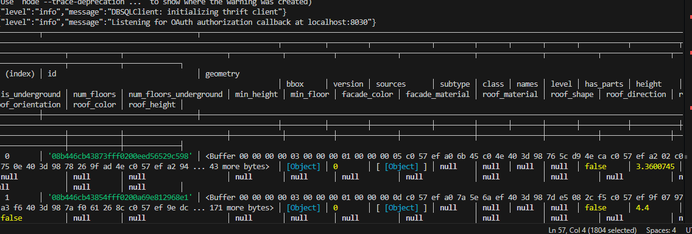

<h3>This post shows how to connect to Azure Databricks using Databricks SQL driver for Node JS and fetch the data</h3>

<h4>Pre-requiste</h4>

1. Install Node.js version 14 or higher version  
2. Install [@databricks/sql](https://www.npmjs.com/package/@databricks/sql) package from npm
3. Create an workspace in Azure databricks and injest a data and save as table in Delta lake.
4. Create personal access token  as outlined [here](https://docs.databricks.com/en/dev-tools/auth/pat.html)
5. Understanding Databricks Authentcation types:

    - using Personal Access Token (PAT)
    - using User to Machine (OAuth User to machine)
    - using machine to machine (OAuth machine to machine)

      `Personal Access Token`: Unique string we generate and we can use to access Databricks API's or CLI. These tokens have defined lifespan, after that which they needs to be regneerated.

      `U2M` : Intially, user must sign in and consent the application accessing their data. Upon authorization, application receives an OAuth token that it can use for subsequent requests on behalf of the user. Lifespan usually an hour, after which the application will automatically attempt to renew the token without further user input 

      `M2M` :  In this flow, a service (the client) uses its own credentials (Client ID and Client Secret) to request an access token from an OAuth 2.0 authorization server. This token is then used to access protected resources on another service (the resource) 


6. Save below code as `server.js`

7. Run ` node server.js` 


```javascript

require('dotenv').config();

const { DBSQLClient } = require('@databricks/sql');

// Retrieve connection parameters from environment variables .env file
const serverHostname = process.env.DATABRICKS_SERVER_HOSTNAME;
const httpPath = process.env.DATABRICKS_HTTP_PATH;
const token = process.env.DATABRICKS_TOKEN; 

// Check if required environment variables are set
if (!serverHostname || !httpPath || !token) {
    throw new Error("Cannot find Server Hostname, HTTP Path, or Token. " +
                    "Check the environment variables DATABRICKS_SERVER_HOSTNAME, " +
                    "DATABRICKS_HTTP_PATH, and DATABRICKS_TOKEN.");
}

// Create a new Databricks SQL client
const client = new DBSQLClient();

//Define connection options
const connectOptions = {    
    host: serverHostname,
    path: httpPath,
    token: token 
};


// Attempt to connect to Databricks
client.connect(connectOptions)
  .then(async client => {
    const session = await client.openSession();
    const queryOperation = await session.executeStatement(
      'SELECT * FROM lv_poc.geospatial.buildings LIMIT 2',
      {
        runAsync: true,
        maxRows:  10000 // This is default. This can be updated in worksspace advanced options tab [spark config section] : spark.databricks.query.displayMaxRows.
      }
    );

    const result = await queryOperation.fetchAll();

    await queryOperation.close();

    console.table(result);

    await session.close();
    await client.close();
})
.catch((error) => {
  console.error(error);
});

```


Result :

  


