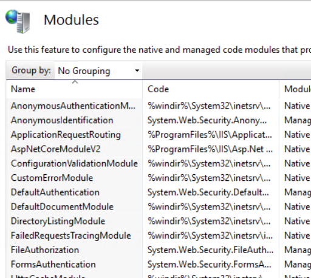

## Introduction:

I am currently working on a requirement for one of our custom web mapping solutions that needs to authenticate with the ArcGIS Platform in order to access web maps and layers. The objective is to create an API for authentication, which can be called in the application to perform authorization and authentication.

ArcGIS REST JS is a lightweight collection of JavaScript modules that allows users to access ArcGIS services and develop mapping and spatial analysis applications.

Esri recommends two ways of achieveing Authentication using Esri ArcGIS REST JS via ArcGIS Identity Manager.

- ArcGISIdentityManager.beginOAuth2 and ArcGISIdentityManager.completeOAuth2 for oAuth 2.0 in browser-only environment.
- ArcGISIdentityManager.authorize and ArcGISIdentityManager.exchangeAuthorizationCode for oAuth 2.0 for server-enabled application.
     
Here is a [sample code provided by Esri](https://github.com/Esri/arcgis-rest-js-samples/blob/main/samples/express-oauth-advanced/README.md) for implementing advanced OAuth on the server side, which includes options for refreshing tokens and handling expiration.

#### Advanced uses for Authentication Features

- Implement server-based OAuth 2.0 to obtain a refresh token. Store the resulting access token and refresh token in a session object on the server, which can be referenced via an encrypted cookie.
- Send the short-lived access token information to populate ArcGISIdentityManager in a client-side environment, while keeping the refresh token secure on the server.
- Customize ArcGISIdentityManager to request a new short-lived access token from the server when needed.
- Store a session ID in an encrypted cookie. Delete cookie for elapsed time interval
- Synchronize the authentication between ArcGISIdentityManager and the JavaScript API IdentityManager to access private content, such as web maps.

#### Security Best Practices 
- Only the encrypted session ID is stored in a cookie on the client side.
- Session information is encrypted when it is stored on the server's disk.
- Short-lived tokens, which expire after 30 minutes, are used on the client. New tokens are automatically requested from the server when needed.
- The refresh token on the server is initially valid for 2 weeks, but it is extended for an additional 2 weeks each time the user accesses the app.

While the Esri sample works perfectly on localhost, the challenge is how to deploy this application on a Windows web server (IIS). Additionally, how to set up a reverse proxy in IIS to forward requests from your FQDN to your local Node.js Express application.


### Here are steps :

1. First clone the project from the [here](https://github.com/Esri/arcgis-rest-js-samples/tree/main/samples/express-oauth-advanced)

2. Set up your own credentials. i.e. create client id and update redirect urls 

3. Follow the steps in README.md to successfully to run the app in localhost.

<br> 

      `Here let us assume API runs on http://localhost:3000  and access the API using FQDN like  https://yourcompanyname.com/esri-api`

4. We are going to publish this app on windows webserver (IIS) under the default site on a folder called `esri-api`. IIS (v10) should have Application Request Routing [ARR](https://www.iis.net/downloads/microsoft/application-request-routing) and [URL rewrite](https://www.iis.net/downloads/microsoft/url-rewrite).

   <br>

      

    Check if ARR and Rewrite URL are available under `modules`

   <br>

    


6. Enable Proxy on Application Request Routing
    
    
    


     ` Check Enable Proxy`

     ` Make sure you uncheck Reverse host in response header` 


5. Update `Server.js` code needs to updated . Code snippets provided for reference
```
    const virtualDir = "/esri-api";  

    const oauthOptions = {
      clientId: process.env.CLIENT_ID,
      redirectUri: process.env.REDIRECT_URI,
      portal: "https://www.arcgis.com/sharing/rest" // Add this line
    };
   
    app.get(`${virtualDir}/`, (req, res) => {
      res.sendFile(path.resolve("pages/index.html"));

    app.get(`${virtualDir}/authorize`, function (request, response) 

    app.get(`${virtualDir}/authenticate`, async function (request, response))

    app.get(`${virtualDir}/refresh`, function (request, response) 
    )
```

6. Update index.html, app.html button href with "/esri-api/{endpoint}"

7. In your .env REDIRECT URL should be https://yourcompanyname.com/esri-api/authenticate" . This value should be added in AGS online client APP redirect URIs . Thats important.

8. Update web.config - Reverse Proxy for NodeApp and ArcGIS response URL fix along with tracing 

```
<?xml version="1.0" encoding="UTF-8"?>
<configuration>
  <system.webServer>
    <rewrite>
      <rules>
        <rule name="ReverseProxyToNodeApp" stopProcessing="true">
          <match url="(.*)" />
          <conditions>
            <add input="{REQUEST_FILENAME}" matchType="IsFile" negate="true" />
            <add input="{REQUEST_FILENAME}" matchType="IsDirectory" negate="true" />
          </conditions>
          <action type="Rewrite" url="http://localhost:3000/esri-api/{R:1}" />
        </rule>
      </rules>

      <outboundRules>
        <!-- Preserve ArcGIS Location Header -->
        <rule name="Preserve External Location Headers" enabled="true">
          <match serverVariable="RESPONSE_Location" pattern=".*arcgis\.com.*" />
          <conditions>
            <add input="{RESPONSE_Location}" pattern="arcgis\.com" />
          </conditions>
          <action type="None" />
        </rule>
         <rule name="Fix Redirect URI" enabled="true">
          <match serverVariable="RESPONSE_Location" pattern="http://localhost:3000/esri-api/authenticate" />
          <action type="Rewrite" value="https://yourcompanyname.com/esri-api/authenticate" />
        </rule>
      </outboundRules>
    </rewrite>

    <proxy enabled="true" />

    <tracing>
      <traceFailedRequests>
        <add path="*">
          <traceAreas>
            <add provider="WWW Server" areas="Authentication,Rewrite,RequestRouting" verbosity="Verbose" />
          </traceAreas>
          <failureDefinitions statusCodes="200-500" />
        </add>
      </traceFailedRequests>
    </tracing>

  </system.webServer>
</configuration>

```

9. The App is published under default website in virtual directory folder 'esri-api'
   This application should run on dedicated Application pool called as Node.js 

     

10. We can easily trace failure request . Here is document to [read](https://learn.microsoft.com/en-us/troubleshoot/developer/webapps/iis/health-diagnostic-performance/troubleshoot-arr-using-frt-rules)

11. If webserver registered with valid FQDN. You can access the app in your browser https://yourcompanyname.com/esri-api/pages should display the app like this below

     

12. On clicking `Sign in with ArcGIS` to redirect to arcgis.com with your client id and redirect url

`https://www.arcgis.com/sharing/rest/oauth2/authorize?client_id={client_id}&expiration=20160&response_type=code&redirect_uri=http%3A%2F%2Fyourcompanyname2Fesri-api%2Fauthenticate&state=b4fc835c5685bfe53d353ecb90ab85f262858d59`

13. Upon entering user credentials ; it should authorize and authenticate with ArcGIS and return back to app page with access token and other details as the response.

  

  Hope this post is helpful in publishing Authenticating API on IIS webserver.

### Links

1. [URL rewrite tips and tricks - ](https://ruslany.net/2009/04/10-url-rewriting-tips-and-tricks/)

2. [Deploying NodeJS Application on Windows IIS](https://alex.domenici.net/archive/deploying-a-node-js-application-on-windows-iis-using-a-reverse-proxy)