This is an introductory guide on using QGIS SCP (Semi-Automatic Classification/Supervised Classification) for classifying land cover using Landsat data.

Before we dive in, let's start with some key basics.

<h3>Spectral Vs Informational Classes:</h3>

**Spectral Classes** : Group of pixels that are uniform with respect to their pixel values in *several spectral bands*

**Informational Classes** : Categories of interest to users of the data (i.e Water, Urban, Agriculture, Forest etc)

```
Image classification is the process of GROUPING spectral classes and assgining them informational class names

```


<h3>Land Cover Mapping Basics</h3>

Keep in mind that objects on the
ground reflect electromagnetic
radiation differently depending on the wavelength

-  This pattern of relection is known as the object's *spectral signature* 

- For ex,  $\textcolor{green}{\textsf{(Green)}}$ vegetation absorbs  $\textcolor{red}{\textsf{(Red)}}$ light but reflects near-infrared (NIR) wavelengths.


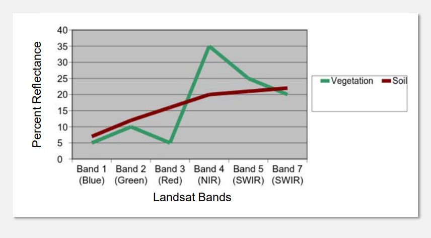

Analyze spectral signatures by plotting the reflectance values of Band 3   $\textcolor{red}{\textsf{(Red)}}$  against Band 4 (NIR).

- Different objects, like soil, water, and vegetation, will appear in distinct areas on the plot.
- The software (QGIS and Others) uses this information to differentiate between various land cover types.

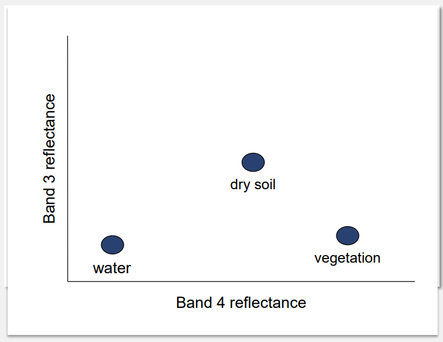

<h3>Image Classification</h3>


```
Digital image classification is a way to group similar pixels in an image into different land cover types, like water, forests, or cities. There are three main methods: unsupervised, supervised, and object-based. 

In supervised classification, the user selects sample areas for each type of land cover, called "training sites." The software then uses these samples to figure out what the rest of the image shows.  The classification process relies on the spectral signature defined by the training set, with the software assigning classes based on their closest match to the training data.
```

- Approaches :  Pixel-Based Vs Objects-Based
- Methods    :  Supervised Vs Unsupervised 


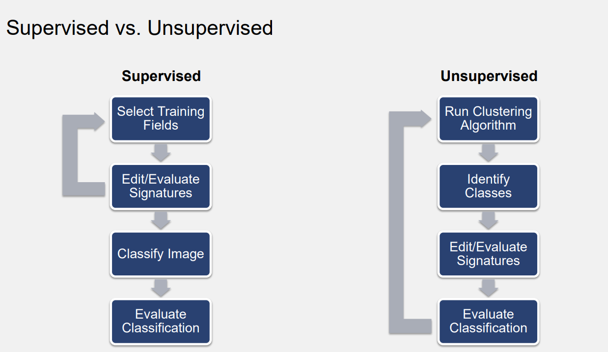


<h3> Semi-Automatic Classification Plugin (SCP) </h3>

- Developed by Luca Congedo
-  Free, open-source plugin for QGIS that allows for supervised classification
- It provides:
  - Several tools for the download of imagery
  - Preprocessing (Digital Numbers to Top of Atmosphere Reflectance)
  - Training site selection and analysis
  - Classification algorithms
- Documentation: Congedo, Luca (2016). [Semi-Automatic Classification Plugin Documentation](https://fromgistors.blogspot.com/p/semi-automatic-classification-plugin.html)

<h2> Workflow </h2>

- Install QGIS SCP Plugin
- Download required data from USGS earth explorer site
- Subset the image and filter to area of interest
- Create a training input file 
- Create the region of interest (ROI)
- Analyze ROI (w/ different parameters)
- Create a classification preview 
- Generate a classification output 


<h4> Step 1 : Install Plugin </h4>

  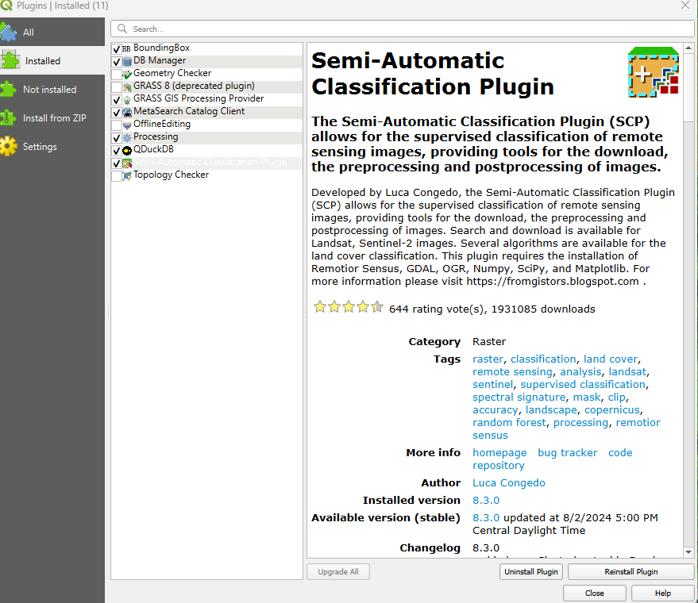

<h4> Step 2 : Install Remotior Sensus </h4>

  [Install Remotior Sensus](https://remotior-sensus.readthedocs.io/en/latest/installation.html). It is a Python package that allows for the processing of remote sensing images and GIS data.

  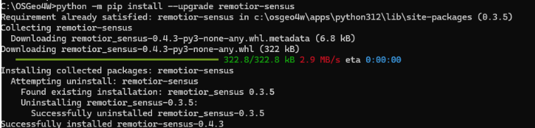

<h4> Step 3 : Account creation and Data Download </h4>

  - Go to http://earthexplorer.usgs.gov/  
  - Before downloading data products, users must complete registration at 
    http://ers.cr.usgs.gov/register/ 
  - The EE process is divided into four sections: Search Criteria, Data Sets, Additional Criteria, and Results 
  -  We will be downloading a Landsat 8 image 


     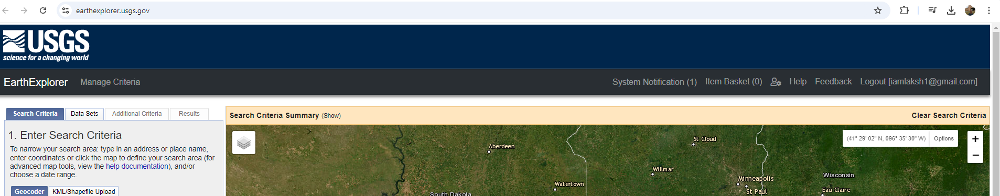


     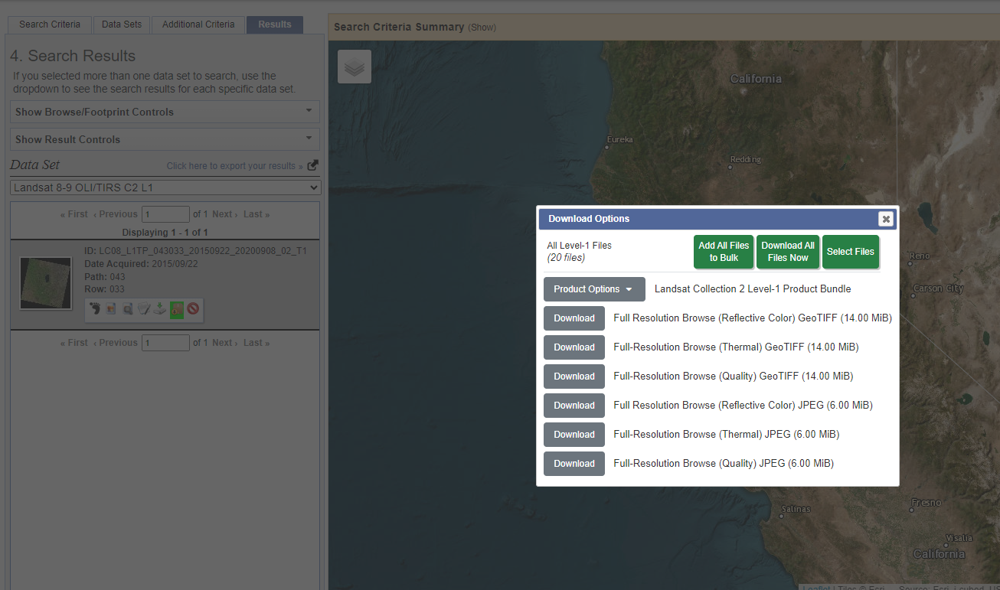


<h4> Step 4 : Load and Convert the image  </h4>

    - Use 0 as value for NoData
    - Apply DOS1 atomospheric correction
    
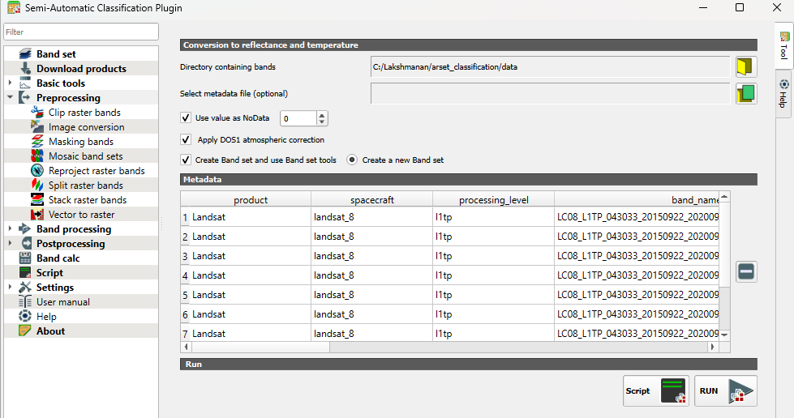

<h4> Step 5 : Generate Regions of Interest </h4>

| Macro Class Name |  Macro Class ID | Class Name | Class ID
| --- | --- | --- | --- |
Water | 1 | Lake | 1
Vegetation | 2| Forest | 2
Vegetation | 2 | Oak/Shrub| 3
Bare Ground | 3| Burned | 4
Bare Ground |3| Forest Harvest | 5
Bare Ground | 3| Other | 6


<h4> Step 6 : Training </h4>


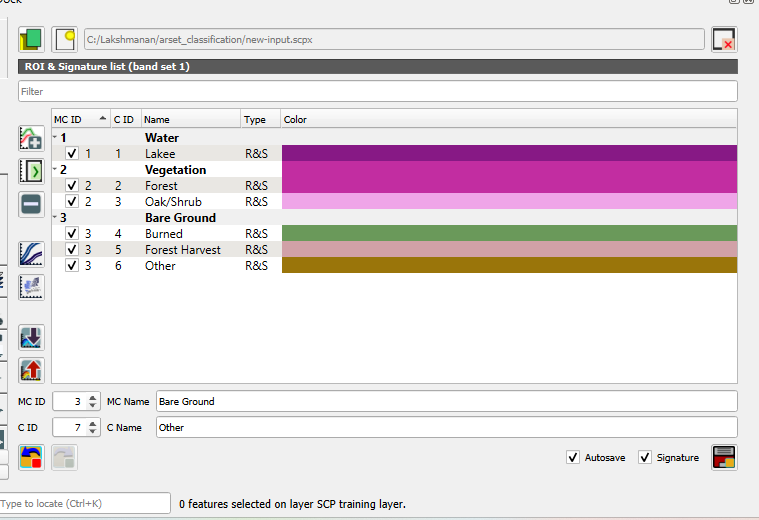

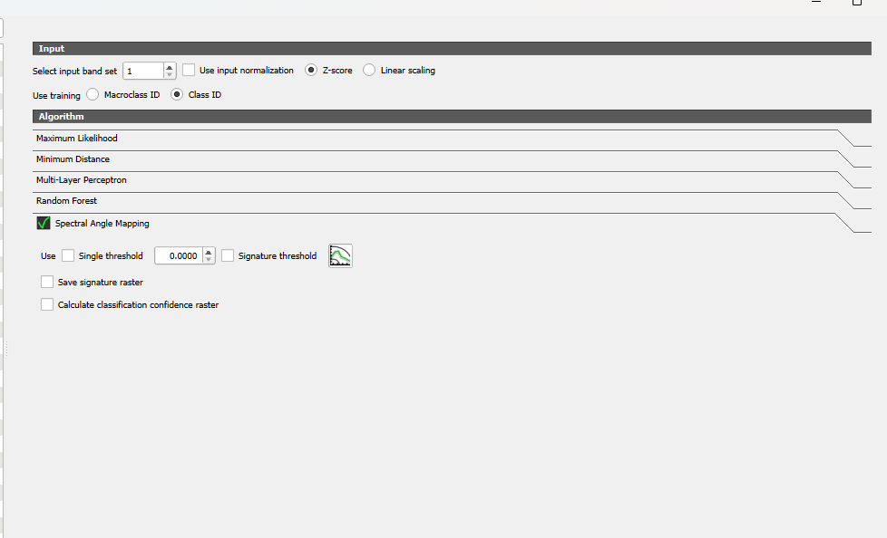

<h4> Step 7 : Output </h4>

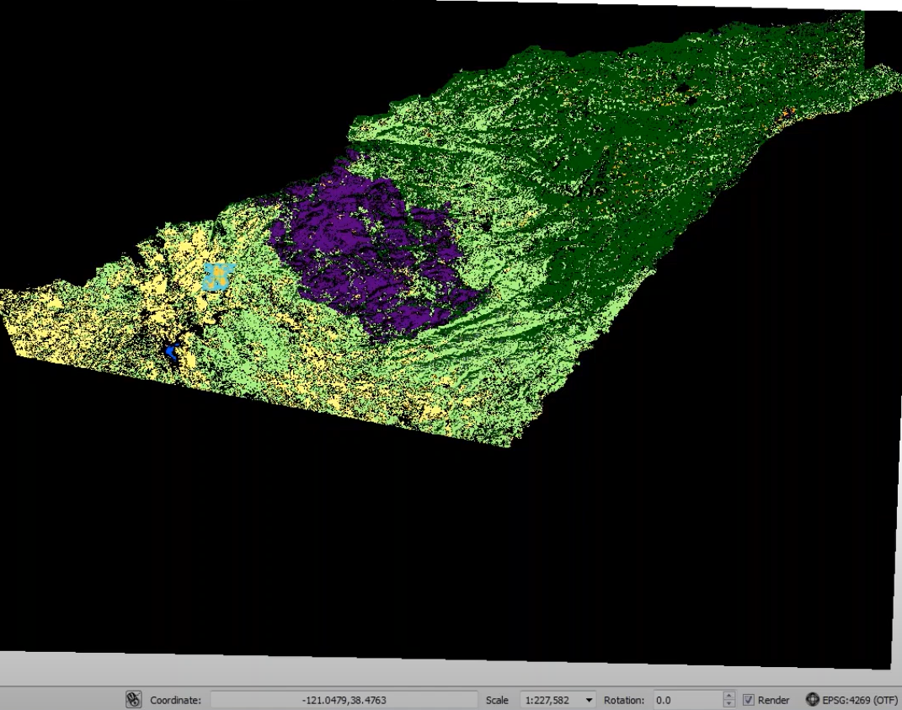

<h4> References </h4>

[QGIS SCP Manual](https://github.com/semiautomaticgit/SemiAutomaticClassificationManual/blob/master/scp_dock.rst#id152)
