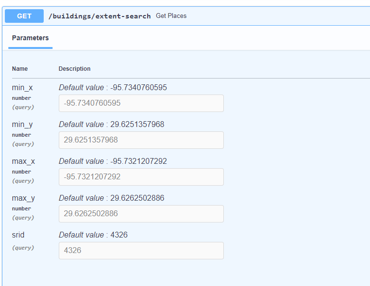
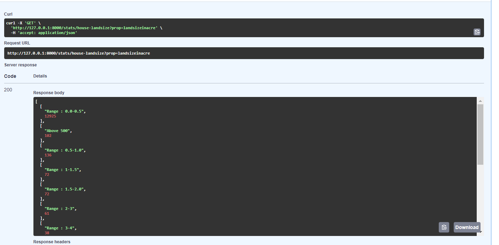

This post walks you through the process of creating an API with Overture Map Data using DuckDB in FastAPI framework.

## What is Overture Maps Foundation

Overture Maps foundation : Joint Development Foundation, Overture is dedicated to the development of reliable, easy-to-use, and interoperable open map data that will power current and next-generation map products.

Dataset is organized by theme and size.

    - addresses
    - base: water, land, land use, infrastructure, land cover
    - buildings
    - divisions
    - places
    - transportation

Here are link to read more about   [Schema](https://github.com/OvertureMaps/schema), [Data](https://github.com/OvertureMaps/data), [Docs](https://github.com/OvertureMaps/docs) , [Examples](https://docs.overturemaps.org/examples/), [Data Guides](https://docs.overturemaps.org/guides/)

The latest release of **[Overture Maps Foundation](https://docs.overturemaps.org/release/latest/)** is now available in GeoParquet format, providing a more efficient way to perform spatial operations when working with subsets of the dataset. 

Overture data set adopts Global Entity Reference System (GERS).  GERS is a framework for structuring, encoding, and matching map data to a shared universal reference. All features in Overture have a unique ID (kind of UID), called Overture IDs or GERS IDs, are registered to GERS and they are stable. GERS provides a mechanism to match features across datasets, track data [stability](https://docs.overturemaps.org/gers/stability/), and detect errors in the data. 

## What is DuckDB?

`DuckDB is an analytics tool that allows you to query remote files and download only the data you want`

DuckDB is a powerful **analytical database** designed for efficient handling of `large` datasets. It is particularly notable for its support of geospatial data through its spatial extension and its seamless integration with Parquet, a popular columnar storage format.

DuckDB is often called "SQLite for analytics." It operates as an in-process database, making it simple to embed within larger applications, such as directly querying pandas dataframe objects without the need for network or inter-process communication. Additionally, DuckDB offers a command-line interface (CLI) for direct querying from the terminal.

DuckDB is not intended for use in applications that require **concurrent write access** or strict transactional integrity, as it is tailored for **analytical workloads**. Although it can handle data spilling to disk when memory is exceeded , it performs best with datasets that mostly fit in RAM (*trick SET `preserve_insertion_order` to false for better memory handling*), limiting its effectiveness for processing data at the terabyte scale.  Moreover, DuckDB is not designed for streaming purposes or  real-time analytics on constantly updating streams. 


## Project Goal

The aim of this project is to build an API using latest data (buildings, POI, address, infrastructure) from Overture Maps foundation using DuckDB for analytical purpose.

## Data Prep

1. [Install DuckDB locally](https://duckdb.org/docs/installation/?version=stable&environment=cli&platform=win&download_method=package_manager&architecture=x86_64)

2. I used python [commmand-line tool](https://docs.overturemaps.org/getting-data/overturemaps-py/) to download the overture maps data.

    `pip install overturemaps`

3. Download the data as parquet format. 

    `overturemaps download --bbox=-95.74443405978232,29.594188821735415,-95.68407326319057,29.661140215266016  -f geoparquet--type=building-o buildings.parquet`

     

4. I chose the study/research area as below. Study area falls in Fortbend County, TX

      


5. Envelope of the study area is below
          

6. On analyzing overture maps data for building theme, the attributes data is limited. So, I want to enrich this data with local county [parcel data](https://gisweb.fbcad.org/arcgis/rest/services/Hosted/FBCAD_Public_Data/FeatureServer/0) from state goverment. On merging, county data with building dataset provided rich attributes for my analysis.

  `Our approach focuses on joining two geospatial polygons, we simply need to determine whether a building is contained within a parcel shape. However, there is a small catch to consider: buildings located on the boundaries of parcel should not be assigned to multiple parcels. To handle this, I used a straightforward method: finding the building's center point with the ST_Centroid function and then checking if this point falls within a parcel shape using the ST_Contains function.`

    ``` shell SQL
        
            COPY(
            SELECT 
                buildings.id as gers, 
                parcel.ownername AS owner,
                parcel.quickrefid AS properyid,
                parcel.oaddr1 AS address,
                parcel.totalvalue AS totalvalue,
                parcel.landvalue AS landvalue, 
                parcel.yearbuilt AS yearbuilt,
                parcel.landsizeac AS landsizeinacre,
                parcel.totsqftlvg AS totalsqftliving,
                parcel.ownerstate AS ownerstate,
                parcel.impvalue AS improventvalue,
                parcel.legal AS legaldescription,
                parcel.taxunits AS tax,
                parcel.nbhdcode AS neighbrhoodcode,
                ST_GeomFromWKB(buildings.geometry) as building_geom 
            FROM '/path/to/buildings.parquet' as buildings 
            JOIN ST_Read('/path/to/PARCELS.shp') as parcel 
                ON ST_Within(ST_Centroid(ST_GeomFromWKB(buildings.geometry)), parcel.geom)
            ) TO '/path/to/output.csv';

    ```

## What am I analyzing?

For the **selected study area** - I set an goal to find an answers to following queries.

1. Determine the number of residential houses and classify the data based on land value, total value, year built, total living square footage, and land size of the houses. This provides a good demographic overview of the locality.
2. Identify the number of commercial establishments.
3. Identify property owners who are in-state and out-of-state.
4. Identify residential houses within a specified area.
5. Generate a list of residential houses with swimming pools, useful for pool service or grill companies.
6. Assess the impact on nearby houses and buildings in case of man-made lakes or streams overflowing during flood season; relevant for home insurance companies.
7. Identify establishments within a given point and buffer radius.

8. Find the shortest path to a specified destination.

8. Identify parking spaces and perform other spatial queries.

### Development Environment Setup

Here are the steps to set up your environment:

1. Here is my another [article](https://iamlaksh1.github.io/site/an-api-with-geospatial-capabilities-using-pixi/) on how to set-up pixi 

4. Folder structure for this project

    

    - init.py is main entry point
    - routers folder has router for places, building, infrastructure, statistics, impact-analysis
    - studyarea folder has all data required for loading to DuckDB

5. Here is list of dependencies installed 

    | Library | Version |
    | --- | --- |    
    | python                 | `3.11`    
    | uvicorn                | `>=0.30.6,<0.31` 
    |debugpy                 | `>=1.8.5,<2`  
    | duckdb                 | `>=1.0.0,<2`          
    | fastapi                | `>=0.110.0,<0.111`                   
    | pydantic-settings      | `>=2.4.0,<3` 
    | spyarrow               | `>=17.0.0` 
    |pyproj                  | `>=3.6.1`

6. To run or debug a simple app in VS Code, click "Run and Debug" or press F5, and VS Code will run the active file. For more detailed debugging, create a launch configuration file to save your settings. This information is stored in a launch.json file in the .vscode folder of your workspace or in your user settings: I named API as "Peccan Grove API"
    
    

7. Run `pixi shell` to activate the project in the terminal. You can view all environment variables using `pixi shell-hook`.

8. If all the above steps worked, you can run and debug the code using F5. You should see the API like this in the browser:

    

9. The GET endpoint `find-places`should return list of places (*251 unique categories available for search*) matching:

    

10. The GET end point `/building/extent-search` to find list of buildings for an given extent

     

11. Buildings Search and other classification results 

     

     

     

     

    

    

    

12. Database and spatial Queries 

    

    

13. Data loading: Since Fort Bend County uses EPSG 2278, I projected the data to the same coordinate system for easier comparison.

``` shell python
       
                    CREATE TABLE {table_name} AS
                    SELECT 
                        {column_selection},
                        ST_Transform(ST_FlipCoordinates(ST_GeomFromWKB(geometry)), '{crs_info}', 'EPSG:2278') AS geom,
                        ST_GeomFromWKB(geometry) AS geomwgs84                  
                    FROM read_parquet('{file_path}');
               
```

14. Some Spatial Queries

*Find an park from given point within 1 mile radius*

``` shell SQL

     SELECT
            *
        FROM
            place
        WHERE
            ST_WITHIN(
                geom,
                ST_Buffer(
                    ST_TRANSFORM(ST_POINT(29.6251357968, -95.7340760595), 'EPSG:4326', 'EPSG:2278'),
                   5280.0
                )
            ) AND categories_primary = 'park';

```

*Classify the land values based on ranges*

``` shell SQL

    SELECT
        CASE 
            WHEN landvalue BETWEEN 0 AND 100000 THEN '0-100,000'
            WHEN landvalue BETWEEN 100001 AND 200000 THEN '100,001-200,000'
            WHEN landvalue BETWEEN 200001 AND 300000 THEN '200,001-300,000'
            -- Add more ranges as needed
            ELSE 'Above 300,000' -- Any other range above the highest defined range
        END AS landvalue_range,
        COUNT(*) AS count
    FROM
        building_copy  
    GROUP BY
        landvalue_range
    ORDER BY
        MIN(landvalue);
```

*Swimming Pools with-in buffer distance of 20 ft*

``` shell SQL

    SELECT  
        sp.*,
        b.*
    FROM
        water sp
    JOIN
        building_copy b
    ON
        ST_Intersects(
            ST_Buffer(sp.geom,20 ), 
            b.geom                  
        )
    WHERE
        sp.subtype = 'human_made'
        AND sp.class = 'swimming_pool'
        AND b.subtype = 'residential'
        AND b.class = 'house';

```

## Learnings

1. I automated the data loading from a Parquet file into DuckDB using the local coordinate system, EPSG 2278. 

2. The columns were extracted and flattened, and a schema structure was provided for each theme.

3. During data validation, I noticed several inaccuracies—particularly in the Overture building dataset, where many attributes were missing, especially for man-made structures like swimming pools in our neighborhood.

4. Spatial queries in DuckDB differed somewhat from other databases 

## Conclusion

I am developing a front-end application using React to display data and provide additional details. This project offers insights into Overture Maps data, its schema, and data quality. DuckDB shows great potential for data analysis and enables the creation of simple dashboards with ease. [Github Repo](https://iamlaksh1.github.io/site/)


## Useful References

1. [DuckDB spatial Function reference](https://github.com/duckdb/duckdb_spatial/blob/main/docs/functions.md)
2. [Geospatial Analysis using DuckDb](https://spatial-dev.guru/2023/11/26/setting-up-duckdb-for-geospatial-analysis/)
3. [DuckDB configuration](https://duckdb.org/docs/configuration/overview.html)
4. [DuckDB Performance Tuning](https://duckdb.org/docs/guides/performance/my_workload_is_slow)
5. [DuckDB Persitent Database](https://duckdb.org/docs/connect/overview#persistent-database)
6. [Data conversion tool](https://quickmaptools.com/)
7. [Kepler GL for Data visualization ](https://kepler.gl/demo)
8. [DBeaver working spatial data](https://github.com/dbeaver/dbeaver/wiki/Working-with-Spatial-GIS-data#viewing-string-or-binary-data-from-any-database-on-a-map)
9. [ST_Transform with Flip coordinates](https://github.com/pyproj4/pyproj/issues/418)
10. [Boundinb Box ](https://boundingbox.klokantech.com/)
11. [Simon Blog](https://til.simonwillison.net/overture-maps/overture-maps-parquet)
12. [A step by step guide on how to access Overture data in ArcGIS Pro](https://www.spatialnode.net/articles/how-to-query-overture-maps-foundation-data-in-arcgis-pro-with-duck-dbc094f9)
13. [Reading and Writing Parquet in DuckDB](https://duckdb.org/docs/data/parquet/overview.html)
14. [Geojson Viewer](https://geojson.io/#map=2/0/20)
15. [How to view meta-data in DuckDB thread](https://github.com/duckdb/duckdb_spatial/pull/227)
16. [Simple data analysis (SDA) - easy-to-use and high-performance JavaScript library for data analysis](https://github.com/nshiab/simple-data-analysis)
17. [Overture Maps Community Blog posts](https://docs.overturemaps.org/community/)
18. [Overture Maps Building Dataset](https://open.gishub.org/open-buildings/)
19. [Featured Repos ](https://beta.source.coop/)
20. [QGIS DuckDB Plugin](https://oslandia.com/en/2023/11/16/un-plugin-duckdb-dans-qgis/)