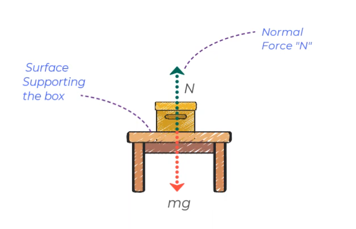
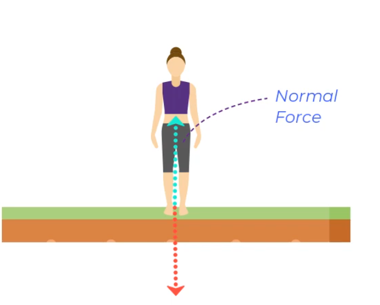
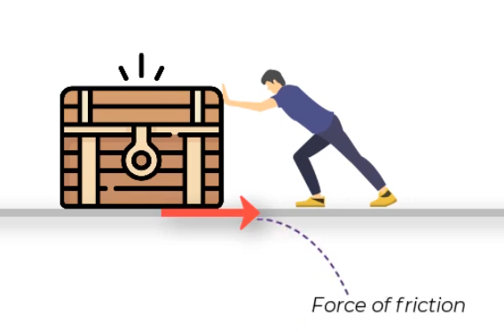
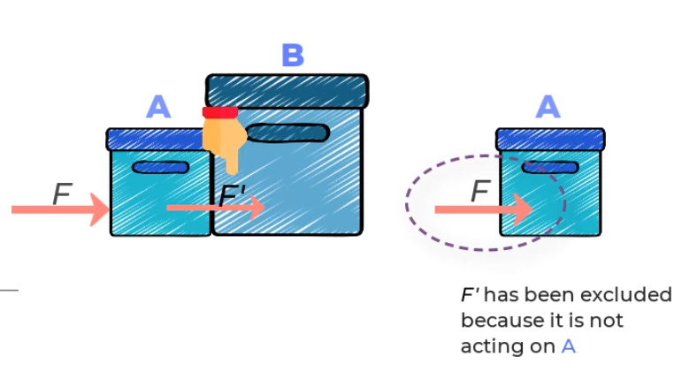
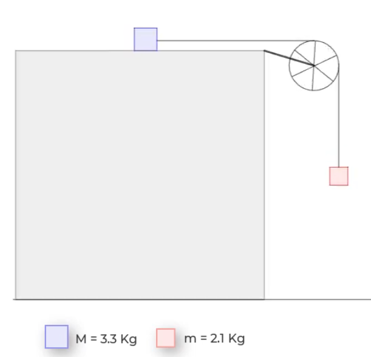
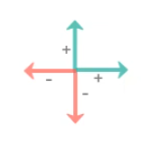
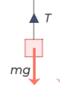
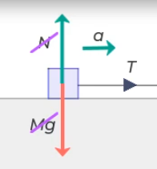
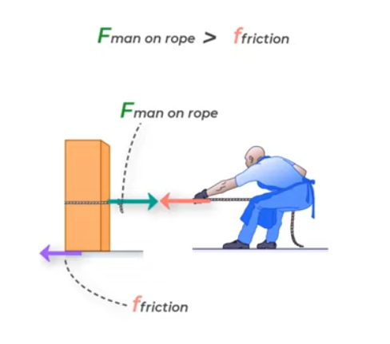
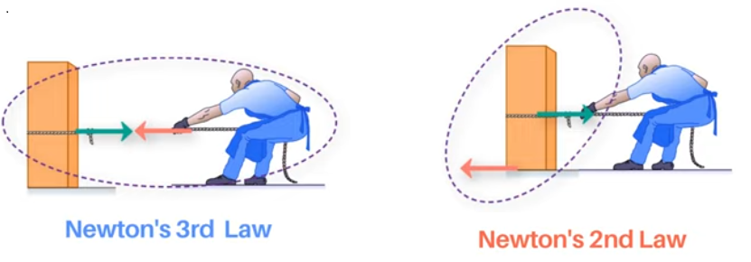

Recently, I’ve been revisiting some basic statics problems, especially those involving force resolution. In this post, I want to walk through how to construct a clear and accurate free-body diagram (FBD) when dealing with multiple forces. I’ll also include a few core principles and quick checklists that are helpful when starting out.

<h4> Types of Forces</h4>

 Here are some of the fundamental forces you’ll encounter while constructing free-body diagrams:

- Gravitational Force:
The weight of an object, always acting vertically downward toward the center of the Earth.

- Normal Force:
The support force exerted by a surface. It always acts perpendicular to the surface and counterbalances the tendency of an object to “press into” that surface due to gravity.

- Frictional Force:
A resistive force that acts opposite the direction of motion (or attempted motion) when one surface slides or tends to slide over another.

- Tension Force:
A pulling force transmitted through a rope, cable, or string. It acts along the length of the rope and pulls equally on the objects it connects.

  
  
  

<h4> How to construct Free Body  Diagram </h4>

1. Isolate the particle/object - The term "free-body" refers to seperating the object or particle from its support. Ignore all extra /physical connections to the object. 

Example of Free body digram for Box A :

  
  

2. Set up a coordinate system –This super important how to set-up a coordinate system. Does the coordimnate system (x-y plane) parallel to line of action or surface? Or clockwise direction as  positive or anti-clockwise direction as negative direction of forces? 

      

3. Identify all applied loads – Show all forces acting on the body, including pushes, pulls, and the body’s weight if it’s significant. Each force should have a variable name and a clearly drawn arrow indicating its direction. 

    - *Take only the External forces acting on the mass*

    - *Take only External forces applied*

    - *Inter-molecular forces vibration molecules /moving electrons should be  ignored. Since their vector sum is zero. Just think, if   vector is not zero then the object will not be stationary*. (see image below)

    - *Forces the mass is impression on other masses this should be ignored*.

      
      
      

4. Determine support reactions – These forces come from the supports you removed when isolating the body. Particle supports act as two-force members, producing either tension or compression.

5. Label everything clearly – Make sure every force on your diagram has either a numerical value or a symbolic variable if the exact value is unknown. The completed free-body diagram should be neat, fully labeled, and ready for analysis.

<h4> Few Points </h4>

1. Does magntidue to force is negative then vector is opposite direction 

2. Tension on any string /cable/ pulley are Tensile force 

3. Frictionless pulley or rope is massles or rope is inline with mass center 

4. System is  in Equilibrium.  $\sum F_x = 0$ and $\sum F_y = 0$

5. Weigh is equal to $W = Mg$ 

<h4> Another Example to understand Newtons Law of Motion  </h4>

When a person pulls a block with a rope. The block pulls back with the same force. But the block moves while the person stays put. Why?

The key is understanding the difference between Newton’s Second and Third Laws. The Second Law looks at the forces on a single object to determine its motion. The Third Law talks about the interaction between two objects. The Third Law itself doesn’t tell you whether an object will move—it’s the net force on each object that matters.

In the block example, the block slides because the person’s pull is stronger than friction. But the person stays in place because their shoes prevent slipping, and friction balances the pull of the rope. The net force on the person is zero, so they don’t move.

In short, action and reaction forces don't cancel because they act on different objects. Each object's motion depends on the net force on it, according to Newton's Second Law. 

*Note 1: Newton Second Law - Only forces acting on a given body - here an box - where two forces involved - Pull force by man, and Frictional force. Sum of these forces determies acceleration*.

*Note 2: Newton third Law - Relates the forces on two different bodies exert on each other ; this does not tells nothing about motion of either body* 

