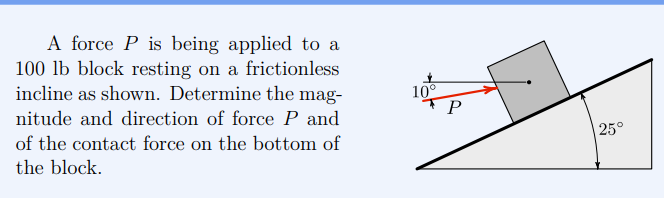
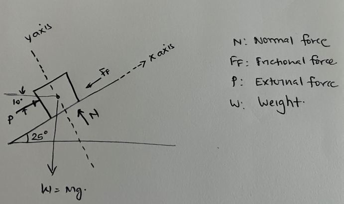
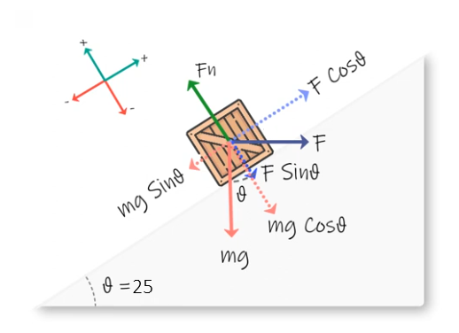

As part of Engineering Mechanics Series. Here is first problem we are going to solve. In case if you need some basics , Please [visit this post](https://iamlaksh1.github.io/site/engineering-mechanics-statics/)  as quick review

<h3> Here is an given problem </h3>

<h4>Ask </h4>

- Find maginitude and direction of Force P
- Find the contact force at bottom of block (say N) 

<h4> Assumptions</h4>

1. Block is in equilibrium - i.e. block is at rest or moving at constant velocity 
2. Frictionless surface - there is no frictional force involved. 

<h4> Given data</h4>

1. Mass of block (M) is 100 lb 
2. The force P is $10°$ inclined to horizontal
3. The surface is inclined at $25°$ to horizontal base 

<h4>In order to draw free body diagram follow these steps </h4>

- Isolate the object - i.e. No external force or internal force. Imagine block is floating in space 

- Identify all forces acting ON the object 

    - Applied External force (P) -  $10°$ above horizontal 
    - Weight - gravity pull straight down
    - Normal force (N)
    - Friction (f) 
  
  Draw each force as an arrow FROM center of Mass

  

- Choose coordinate System

  1. Standard : x-axis horizontal and y-axis vertical. This is simple and straightforward, but need to solve N and f components

  2. Tilted : x-axis along incline surface and y-axis is perpendicular . This is good because 

      a. Normal force N is already along y-axis
      b. f is already along x-axis (though it is zero)
      c. We need to resolve P and W 

  3. Break Forces into components 

    - Incline Angle: $10°$ 
    - Force $P$ Angle relative to the incline:  The incline is $25°$ up from the horizontal. Force $P$ is $10°$ up   from the horizontal. Therefore, the angle between Force $P$ and the incline is:
             $25°$ - $10^°$ = $15°$
       
       Force $P$ pushes "into" the slope at a slight angle of $15°$ relative to the $x$-axis.
  
  4. Resolving forces into components

      **Weight** ($W = 100 \text{ lb}$):
      - $W_x = -100 \sin(25^\circ)$ (Points down the slope)
      - $W_y = -100 \cos(25^\circ)$ (Points into the slope)

      **Applied Force** ($P$):
      - $P_x = +P \cos(15^\circ)$ (Points up the slope)
      - $P_y = -P \sin(15^\circ)$ (Points into the slope)

      **Normal Force** ($N$):
      - $N_x = 0$
      - $N_y = +N$ (Points away from the slope)

      
      
  5. Equilibrium Equations

      Since the block is resting, the sum of forces in both directions must be zero.

      **Equation 1: Sum of forces in the x-direction** ($\Sigma F_x = 0$)

      $$P \cos(15^\circ) - W \sin(25^\circ) = 0$$

      $$P \cos(15^\circ) = 100 \sin(25^\circ)$$

      **Equation 2: Sum of forces in the y-direction** ($\Sigma F_y = 0$)

      $$N - W \cos(25^\circ) - P \sin(15^\circ) = 0$$

      $$N = 100 \cos(25^\circ) + P \sin(15^\circ)$$

6. Calculations

    **Step A: Solve for Force $P$**

    Using Equation 1:

    $$P = \frac{100 \sin(25^\circ)}{\cos(15^\circ)}$$

    $$\sin(25^\circ) \approx 0.4226$$

    $$\cos(15^\circ) \approx 0.9659$$

    $$P = \frac{100 \times 0.4226}{0.9659}$$

    $$P \approx 43.75 \text{ lb}$$

    **Step B: Solve for Contact Force $N$**

    Using Equation 2 and the value of $P$ we just found:

    $$N = 100 \cos(25^\circ) + 43.75 \sin(15^\circ)$$

    $$\cos(25^\circ) \approx 0.9063$$

    $$\sin(15^\circ) \approx 0.2588$$

    $$N = (100 \times 0.9063) + (43.75 \times 0.2588)$$

    $$N = 90.63 + 11.32$$

    $$N \approx 101.95 \text{ lb}$$

**Answer**

1. **Magnitude and Direction of Force $P$:**
   - Magnitude: $43.8 \text{ lb}$ (rounded to 3 significant figures)
   - Direction: $10^\circ$ above the horizontal, pointing up and to the right (as shown in the diagram)

2. **Contact Force on the bottom of the block:**
   - Magnitude: $102 \text{ lb}$ (rounded to 3 significant figures)
   - Direction: Perpendicular to the incline, pointing upwards and to the left (away from the surface)
