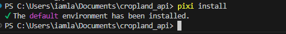
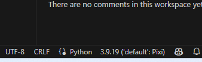
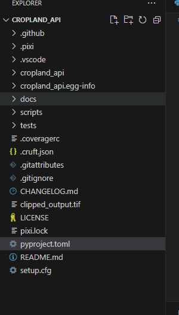
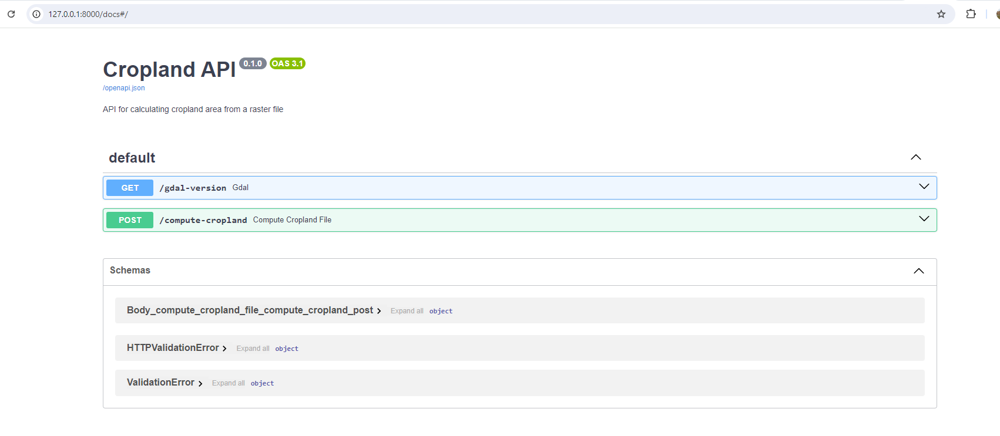
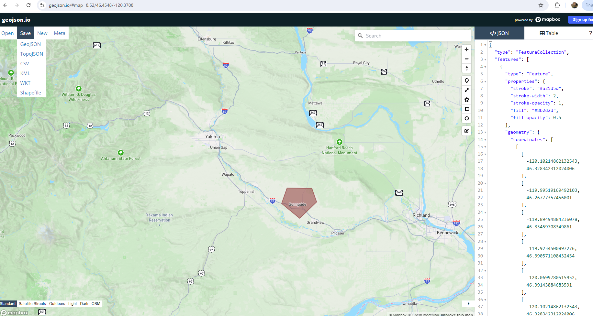
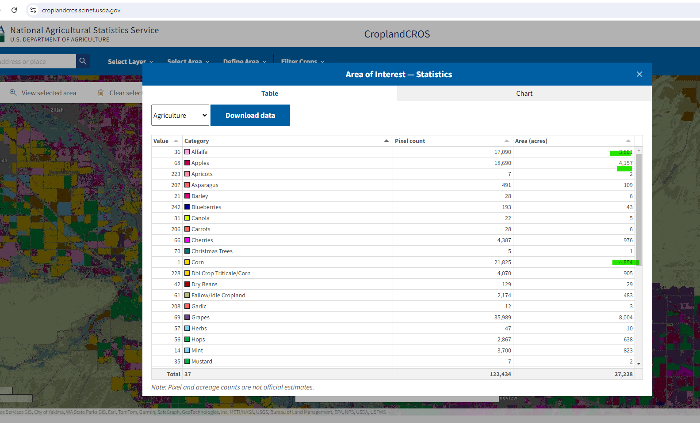

This post guides you through creating an API with geospatial capabilities using FastAPI and pixi.

Nowadays, many data science and machine learning projects use conda for environment management and poetry for package management. This combination works well but presents additional challenges when used with Dockerfiles (e.g., activating the conda environment inside the container). 

Before we further deep-dive, lets see what is pixi?. 

**[Pixi](https://prefix.dev/)** is a new package manager built on the foundation of the conda and conda-forge ecosystem. Pixi has almost all features of poetry plus extra features.

 1. Lockfiles: A pixi.lock file guarantees the same package versions and dependencies across different machines for consistent environments. Supports both Conda channels and PyPi.
2. Tasks: "Pixi tasks" turn complex build steps into simple processes, making workflows smoother and caching results.
3. Automated Installation: Pixi automatically installs dependencies and runs tasks, supporting different features and environments (dev/UAT/prod).
4. Cross-Platform Compatibility: Pixi enables smooth collaboration across various hardware and operating systems.
5. Simplified Setup: With Pixi, setting up is easy: just run pixi run start to install dependencies and start your project.

> The aim of this demo project is to replicate one of the main features of [CroplandCROS](https://croplandcros.scinet.usda.gov/), specifically the **calculation of area statistics** for a input  shape for the year 2022, and return the computed data in JSON format.

I initiated this project using an existing **[python-cookiecutter-template](https://github.com/timothycrosley/cookiecutter-python/)**.

This template supports Python 3.6+ projects and includes tools like black, isort, flake8, poetry, mypy, bandit, bugbear, and more. You can find other templates for various types of Python projects [here](https://github.com/search?q=cookiecutter&type=Repositories).

I have developed this project on my windows laptop. Here are steps

 1. Install Pixi using `Poweshell` in **admin** mode `iwr -useb https://pixi.sh/install.ps1 | iex`
 2. Clone the [cookie-cutter template](https://github.com/timothycrosley/cookiecutter-python/) using [Cruft](https://github.com/cruft/cruft) and answer all prompts  (see below)
   
     
3. Open the project in VS code. Project structure should be 

   
  
4. Delete the pyproject.toml which comes with template. We will create new one using pixi.
5. Open VS code terminal in project root. Run `pixi init --pyproject ` . This will create an new pyproject.toml
6. Update the project section. I am using python > 3.9 

7. Then run following commands in terminal to add the required dependicies (uvicorn, gdal, debugpy,fastapi,geographiclib, and python). Example syntax
 ` pixi add uvicorn` 

 

8. We need to need fast API >=0.110.0,<0.111. This is escape a swagger UI bug in latest 0.112 version. Pyproject.toml gets updated like below.

    

9. Finally run ` pixi install` . This will create an lock-file.

    

We now have a new directory called .pixi in the project root. This directory contains the environment that was created when we ran pixi install. The environment is a conda environment that contains the dependencies that we specified in the pyproject.toml file. Make sure VS code project to select python interpertor as default pixi

Ensure that VS code selects the correct interpertor. Check right hand side bottom. You should see default : pixi 

10. Now the project structure looks this 

10. Read the [configuration-section](https://pixi.sh/latest/features/multi_platform_configuration/) from pixi doc to understand other parameters.
such as platform, platform based dependicies.

11. Pixi comes with ability to define different system requirements for each environment (dev/UAT/prod). etc. You can read about customizations [here](https://pixi.sh/latest/features/multi_environment/#feature-environment-set-definitions)

12. To run or debug a simple app in VS Code, click "Run and Debug" or press F5, and VS Code will run the active file.  For more detailed debugging, create a launch configuration file to save your settings. This information is stored in a launch.json file in the .vscode folder of your workspace or in your user settings

    
13. One of the important step in order to use gdal is set the GDAL_DRIVER_PATH in the environment variable. 
    This can be  easily achieved by writing an custom command under ACTIVATION section . 
    This command will call gdal-activation.bat which is part of pixi environment and echo them.
    
    
    ` [activation] `
    `
    scripts = [
        "cmd /c call %PIXI_PROJECT_ROOT%\\.pixi\\envs\\default\\etc\\conda\\activate.d\\gdal-activate.bat && (if defined GDAL_DATA (echo GDAL_DATA is now: %GDAL_DATA%) else (echo Error: GDAL_DATA is not set after activation))"
    ] `

14. Run `pixi shell` this should activate the project in terminal. You can view all environment variables using `pixi shell-hook` 

15. Update `__init__.py` with the code from github. Also copy two files input raster 2022.tif and cropcode.json for crop codes under root folder.

15. If above all steps worked, we can run the run and debug the code using F5. You should see API like below in browser.

15. The GET end-point gdal-version should return the GDAL and PROJ version like below.

16. The POST end-point compute-cropland calls the compute_cropland_file function processes an uploaded GeoJSON file to perform raster operations using GDAL. It reads the GeoJSON file, validates its format, and uses it to cut a raster file. The function then calculates the area of different crop types within the raster and returns the results.

##
Calculate Crop Areas:

The function reads the crop code JSON file to get a list of crop codes.
The output raster is opened, and the raster band is read as an array.
Unique values and their counts are calculated from the array.
The function maps the crop codes to their respective areas and calculates the area in acres.

17. I tested for small area in Sunnyside, Washington state. Created a geoson using [geojson.io](https://geojson.io/#map=2/0/20). The location.geojson is saved in project , in case if you need.

Compute-cropland  processed the input GeoJSON file and returns calculated area statistics as dictionary in format crop-name: area (acres)

![api-result]](../images/result-from-API.png)

18. In order to validate, same geometry has been used in cropland CROS website [click here](https://croplandcros.scinet.usda.gov/). 

 a) select a Cropland Dat Layer in Select layer to ensure we use Crop land as our input.
 b) Under define area, select import shapefile (convert GeoJSON to shapefile using geojson.io) because CroplandCROS site accepts shapefile. The shape should be same as our location.geojson for comparison.
 c) Select year 2022 in bottom in 'select CDL year' panel. Since our input tiff is only for year 2022 for this demo.
 d) Finally - on analysis button - click 'calculate area statistics'. This will take few minutes to compute the crop land statistics for given input. The table will be displayed. Sort them using crop name. 

 
 

The acre values of the crops from our API will 99.99% matches with CROS website. Ex: Compare for Corn and Apples (being predominant in Washington state) .

This is demo project can be further extended based on various use cases. 

# Notes 

1. Pixi package manager is friendly and easy to add/remove packages. The error messages were descriptive with possible solution makes easy for any developer to adopt.

2. Loaded with good features - environment segeregation, activation, tasks etc. 

3. Here is good article on dockerizing [PIXI in production]( https://tech.quantco.com/blog/pixi-production) 

4. With available cookie cutter templates and cruft, we can able to easily create an package and deploy them. Integerating geospatial capabilities with FastAPI framework makes easy for front-end clients applications.
  