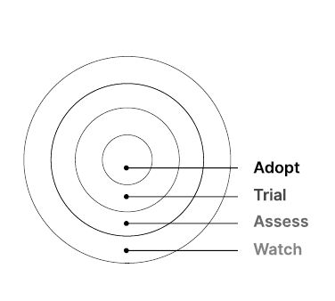

Recently came across the [geospatial tech radar](https://www.element84.com/geospatial/announcing-our-2023-geospatial-tech-radar) article published by Element84.
This was widely recieved with in gis community and many conversations/discussions happened in social media (twitter/linked-in). The radar aims to highlight technologies that are proven and mature (Adopt), technologies that are ready for use but not fully proven (Trial), technologies worth looking at closely but not necessarily for trial (Assess),and technologies that haven't happened yet but have forthcoming developments (Watch). Element84 clearly mentioned Geospatial Technology Radar is opinionated and based on actual experience. 

I loved their categorization to 4 broad themes : Tools, Data, Techniques and Standards.  This is much suited for geospatial industry. 

Here is my view/take on some  of key tools/standards which I use/used 

| Product |  Description | Remark
| --- | --- | --- | 
| GeoPandas |  Working with geospatial data in python is easy | The ecosystem of packages for spatial data handling and analysis in Python is extensive and covers both vector and raster analytics from small to large distributed data. 
| MapLibre GL JS | Library for front-end web maps using WebGL | Open-source TypeScript library for publishing maps on web & mobile
| OpenDrone Map | Open source drone Mapping s/w | ODM CLI, Web based ODM and Light weight API and CLI for processing imagery in cloud. Gaining huge momentum across the industries. **Watch out!**
| PostGIS | Geospatial extension for PostgreSQL | Extends Postgres to use geospatial capablities. Widely adopted in modern geo-spatial development. 
| Raster Vision | Open source ML library and framework for deep learning geospatial imagery | Python based library  used in CV models  with built-in support for chip classfication, object detection and semantic segmentation using Pytorch
| TiTiler | A modern dynamic tile server built on top of FastAPI and Rasterio/GDAL. | Includes STAC support, COG , OC WMTS support ; ability to easy deployment in AWS Lambda 
| AWS Sagemaker geospatial | Released on May 2023. Easier for data scientists and machine learning (ML) engineers to build, train, and deploy ML models for making predictions using geospatial data.  | SageMaker geospatial capabilities provide users with instance types and notebooks optimized for geospatial ML.  
| SpatioTemporal Asset Catalogs (STAC) | Common language to describe geospatial information, so it can more easily be worked with, indexed, and discovered.  | Widely accepted across industries to store/retrive spatial data. Vast ecosystem with tools and resources made them  
| FME | The most powerful integeration tool .  | Widely accepted across industries to data integeration and transformation. FME Desktop and Server is swiss army knife for geospatial workflows. 

** There were more oss tools and libraries used along with products/data offerings from industry gaints - Esri, Mapbox, HERE, CartoDB, Descartes... etc 