This post walks you through the process of creating an API with geospatial capabilities using FastAPI and Pixi.

Many data science and machine learning projects today use Conda for environment management and Poetry for package management. Using Poetry and Conda together in Python projects creates challenges due to their conflicting approaches to environment management and dependency resolution, often leading to inconsistencies in package versions and sources. The combination increases complexity in CI/CD pipelines and Dockerfiles, making it difficult to maintain consistent environments across different stages of development and deployment. 


## What is Pixi?

**[Pixi](https://prefix.dev/)** is a new package manager built on the foundation of the Conda and Conda-forge ecosystem. Pixi offers almost all features of Poetry plus additional capabilities:

1. **Lockfiles**: A `pixi.lock` file guarantees the same package versions and dependencies across different machines for consistent environments. Supports both Conda channels and PyPI.
2. **Tasks**: "Pixi tasks" turn complex build steps into simple processes, making workflows smoother and caching results.
3. **Automated Installation**: Pixi automatically installs dependencies and runs tasks, supporting different features and environments (dev/UAT/prod).
4. **Cross-Platform Compatibility**: Pixi enables smooth collaboration across various hardware and operating systems.
5. **Simplified Setup**: With Pixi, setting up is easy: just run `pixi run start` to install dependencies and start your project.

## Project Goal

The aim of this project is to replicate one of the main features of [CroplandCROS](https://croplandcros.scinet.usda.gov/), specifically the **calculation of area statistics** for an input shape for the year 2022, and return the computed data in JSON format.

## Getting Started

This project was initiated using an existing **[python-cookiecutter-template](https://github.com/timothycrosley/cookiecutter-python/)**. This template supports Python 3.6+ projects and includes tools like black, isort, flake8, poetry, mypy, bandit, bugbear, and more. You can find other templates for various types of Python projects [here](https://github.com/search?q=cookiecutter&type=Repositories).

### Development Environment Setup

Here are the steps to set up your environment:

1. Install Pixi using `PowerShell` in **admin** mode:
   ```powershell
   iwr -useb https://pixi.sh/install.ps1 | iex
2. Clone the `cookie-cutter template` using `Cruft` and answer all prompts:

    

3. Open the project in VS Code. The project structure should look like this:

    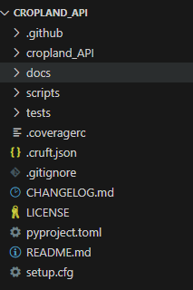

4. Delete the pyproject.toml file that comes with the template. We'll create a new one using Pixi.
5. Open VS Code terminal in the project root. Run:
`pixi init --pyproject`
This will create a new pyproject.toml file.
6. Update the project section. We're using Python > 3.9:
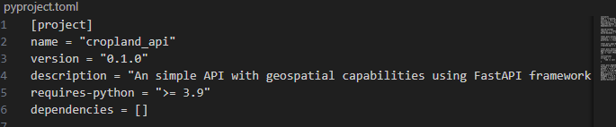
7. Run the following commands in the terminal to add the required dependencies (uvicorn, gdal, debugpy, fastapi, geographiclib, and python, python-multipart). Example syntax:

     ```shell script
        pixi add uvicorn
    ```

     
8. We need FastAPI >=0.110.0,<0.111 to avoid a Swagger UI bug in the latest version. The pyproject.toml should be updated like this:

    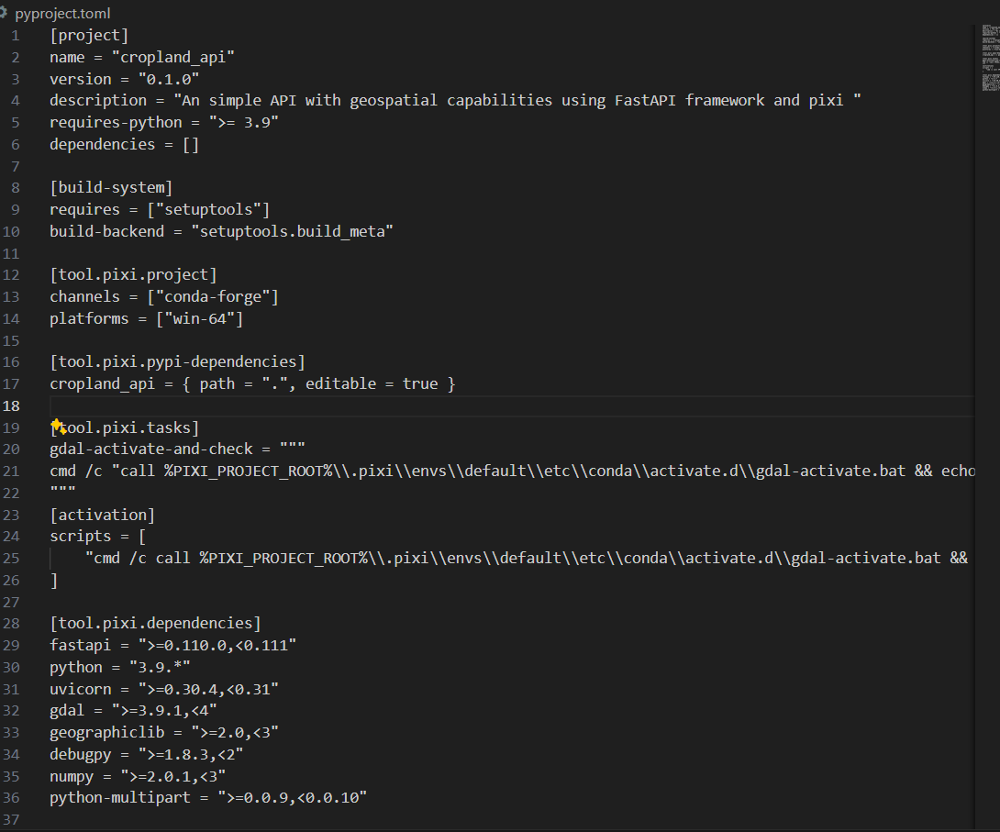
9. Finally, run:
    ``` shell script
        pixi install 
    ```
    This will create a lock file along with default pixi environment

    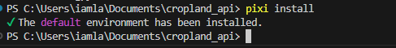

10. You now have a new directory called .pixi in the project root. This directory contains the environment created when we ran pixi install. The environment is a Conda environment that contains the dependencies specified in the pyproject.toml file.

11. Ensure VS Code selects the correct interpreter. Check the bottom right-hand side. You should see "default : pixi":

    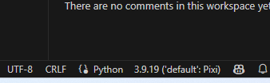

12. The project structure should now look like this:

    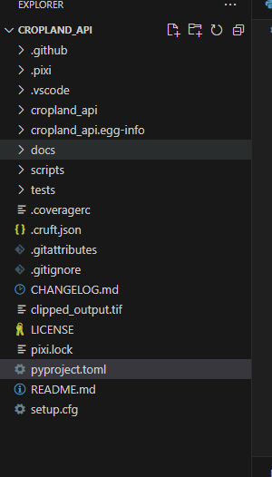

13. Read the [configuration section](https://pixi.sh/latest/features/multi_platform_configuration/) from the Pixi documentation to understand other parameters such as platform and platform-based dependencies.

14. Pixi comes with the ability to define different system requirements for each environment (dev/test/prod). You can read about customizations [here](https://pixi.sh/latest/features/multi_environment/#feature-environment-set-definitions).

15. To run or debug a simple app in VS Code, click "Run and Debug" or press F5, and VS Code will run the active file. For more detailed debugging, create a launch configuration file to save your settings. This information is stored in a launch.json file in the .vscode folder of your workspace or in your user settings:
    
    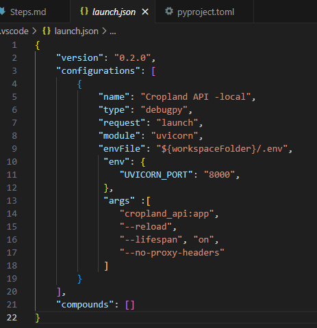

16. An important step to use GDAL is to set the GDAL_DRIVER_PATH in the environment variables. This can be easily achieved by writing a custom command under the ACTIVATION section. This command will call gdal-activation.bat, which is part of the Pixi environment, and echo the results:

```shell script

[activation]

scripts = [ "cmd /c call %PIXI_PROJECT_ROOT%\\.pixi\\envs\\default\\etc\\conda\\activate.d\\gdal-activate.bat && (if defined GDAL_DATA (echo GDAL_DATA is now: %GDAL_DATA%) else (echo Error: GDAL_DATA is not set after activation))"]
   
]

```

17. Run `pixi shell` to activate the project in the terminal. You can view all environment variables using `pixi shell-hook`.

18. Update __init__.py with the code from [GitHub](https://iamlaksh1.github.com). Also, copy two files: the input raster 2022.tif and cropcode.json for crop codes under the root folder.

19. If all the above steps worked, you can run and debug the code using F5. You should see the API like this in the browser:

    

20. The GET endpoint `gdal-version`should return the GDAL and PROJ versions like this:

    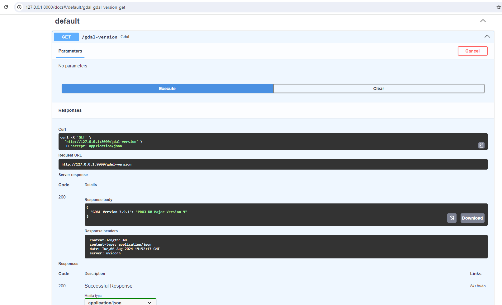

21. The POST endpoint `compute-cropland` calls the `compute_cropland_file` function, which processes an uploaded GeoJSON file to perform raster operations using GDAL. It reads the GeoJSON file, validates its format, and uses it to cut a raster file. The function then calculates the area of different crop types within the raster and returns the results.

## Calculate Crop Areas

The function reads the crop code JSON file to get a list of crop codes. The output raster is opened, and the raster band is read as an array. Unique values and their counts are calculated from the array. The function maps the crop codes to their respective areas and calculates the area in acres.

22. I tested for a small area in Sunnyside, Washington state. Created a GeoJSON using [geojson.io](https://geojson.io/#map=2/0/20). The `location.geojson` is saved in the project in case you need it.

    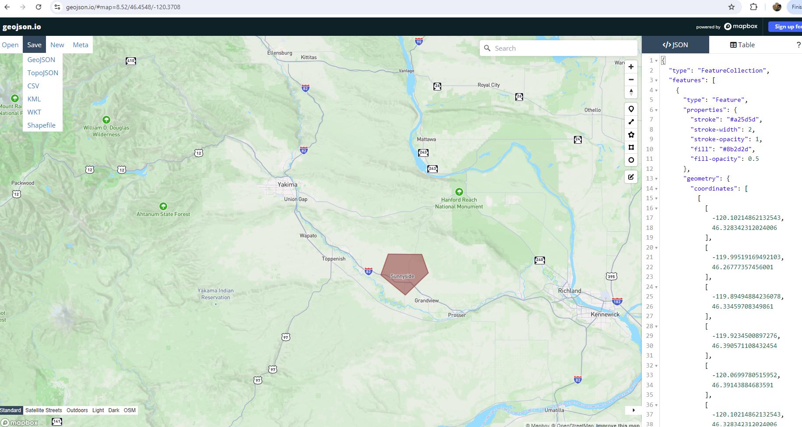
    
23. `compute-cropland` process the input GeoJSON file and returns calculated area statistics as a dictionary in the format `crop-name: area (acres):`

24. To validate, the same geometry has been used in the CroplandCROS website [click here](https://croplandcros.scinet.usda.gov/) and follow the below steps:

- Select a Cropland Data Layer in `Select layer` to ensure we use Cropland as our input.
- Under `Define area`, select `Import shapefile` (convert GeoJSON to shapefile using geojson.io) because the CroplandCROS site accepts shapefiles. The shape should be the same as our `location.geojson` for comparison.
- Select `year`2022 in the bottom `Select CDL year` panel, since our input TIFF is only for the year 2022 in this demo.
- Finally, on the `analysis` button, click `Calculate area statistics`. This will take a few minutes to compute the cropland statistics for the given input. The table will be displayed. Sort them by crop name.


    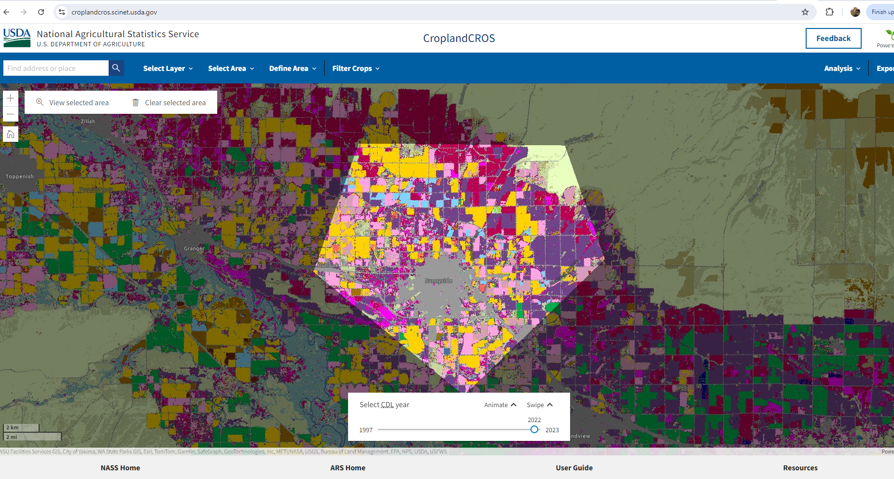


    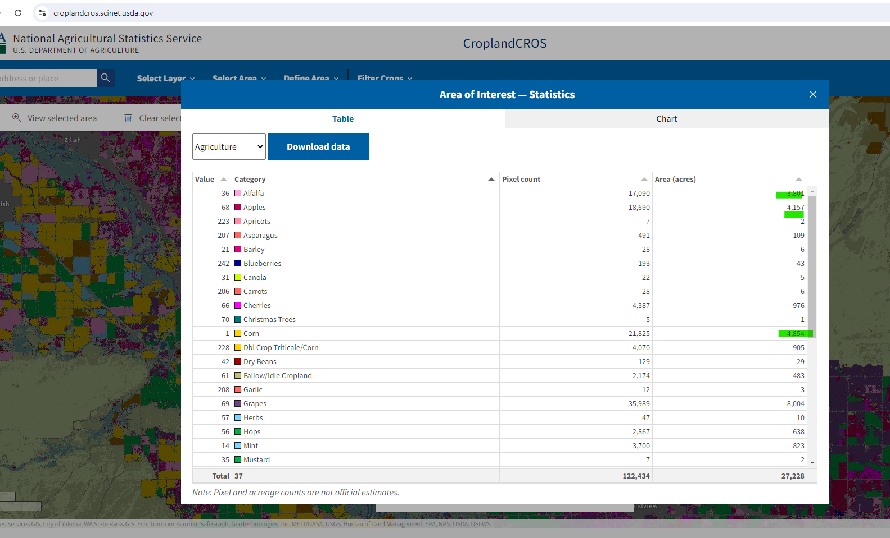


    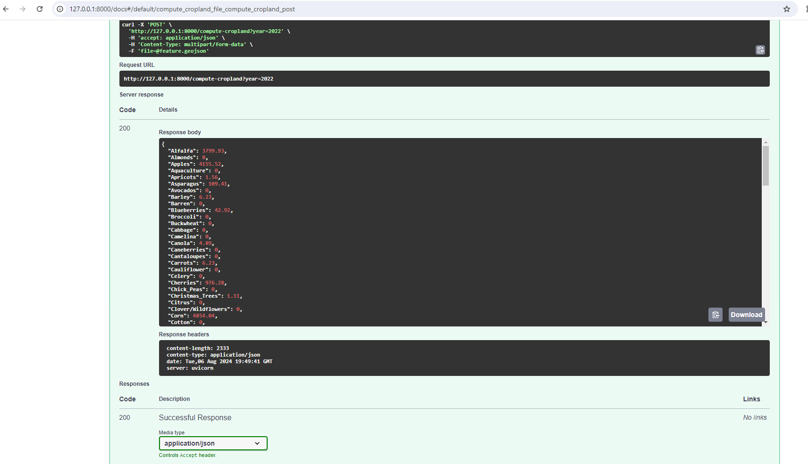


The acre values of the crops from our API will 99.99% match with the CROS website. For example, compare the values for Corn and Apples (being predominant in Washington state).
This demo project can be further extended based on various use cases.

## Conclusion


The Pixi package manager is user-friendly and makes it easy to add/remove packages. The error messages are descriptive with possible solutions, making it easy for any developer to adopt.
Pixi is loaded with useful features - environment segregation, activation, tasks, etc.
Here's a [good article](https://tech.quantco.com/blog/pixi-production) on dockerizing pixi in production.

With available cookie-cutter templates and Cruft, we can easily create a package and deploy it. Integrating geospatial capabilities with the FastAPI framework makes it easy for front-end client applications.

