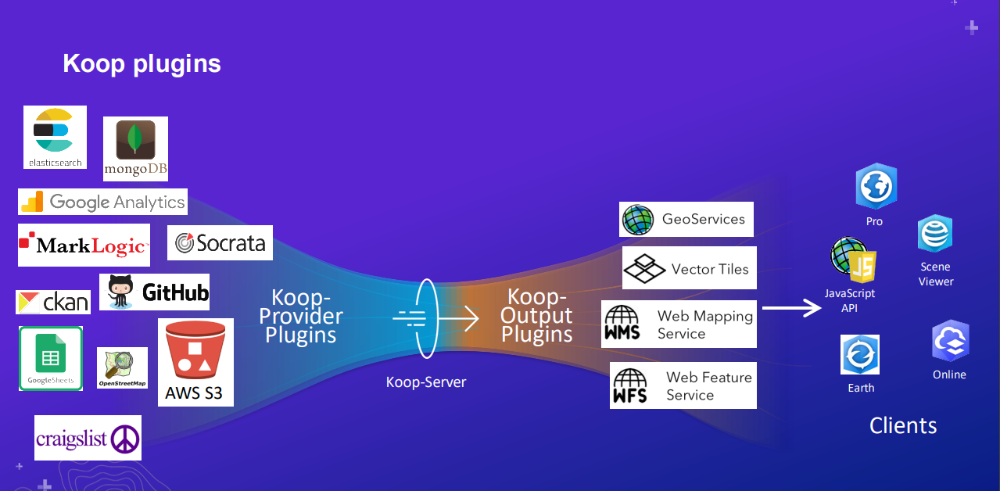
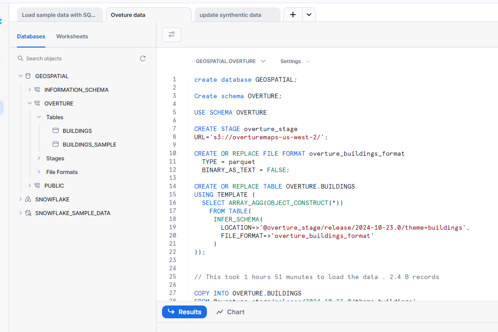
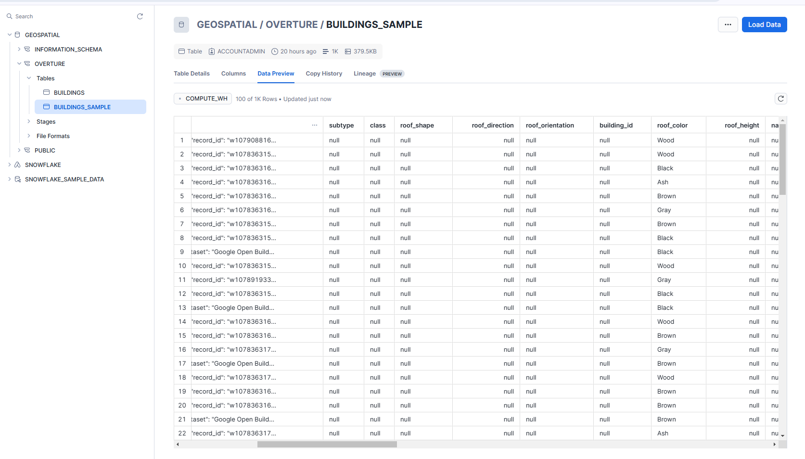
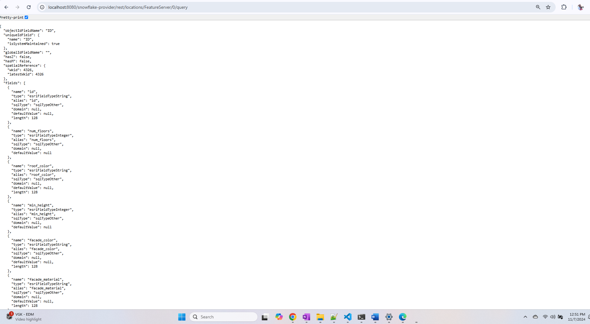

```In this article, I will walk you through the process of ingesting geospatial data from the Overture Maps Foundation into Snowflake, using a step-by-step approach. Additionally, we will leverage the Snowflake-Koop provider to access and serve the ingested data as a GeoService. ```

<h4>What is Koop.js ?</h4>

- Geospatial data server for the web; built using Node JS w/ javascript (a.k.a RESTful web server)
- Transform/serves data from from remote APIs with HTTP requests
- Support geospatial operations
- Built-in support for Geoservice Spec (for ArcGIS clients)
- "Plugins" allow quick and customuze deployments
- Underlying tech for custom data feeds in ArcGIS Enterprise.

Common challenges with data feeds in any enterprise includes:

- The source data format being tied to a specific business application,
- The format being controlled by an external entity,
- The lack of support for the format in existing SDE or ETL systems.

  

<h4> Overture Building Data in Snowflake WH</h4>

The [Overture Maps Foundation](https://docs.overturemaps.org/release/latest/) recently released its first global open map dataset, which includes below themes compiled from various open map data sources:

    Addresses
    Base
    Buildings
    Divisions
    Places
    Transportation

We can download the data from S3 or Azure (latest release October 2024)

` s3://overturemaps-us-west-2/release/2024-10-23.0 ` 

`wasbs://release@overturemapswestus2.blob.core.windows.net/2024-10-23.0`

<h5>Ingestion: </h5>

Our first step will be to ingest the data into the Snowflake database. The dataset layers are available as Parquet files stored in AWS and Azure cloud storage. We’ll load data from an S3 bucket, though the process is similar for Azure.

In Snowflake, loading data from external cloud storage typically involves creating a stage, defining the file format, setting up a table with the required columns, and finally using the COPY INTO command to load the data. We’ll go through each of these steps in detail.

<h5>Steps:</h5>

1. Create an Snowflake trial account (valid for 30 days)
2. By default, it creates an user account as "ACCOUNT ADMIN" role
3. Snowflake comes with two database a) snowflake b) snowflake_sample_data
4. Snowflake Sample Data database comes with variety of dataset and comes with lot of worksheets for come data ingestion work-flows.


``` sql

-- Database, schema creation for GIS data

create database GEOSPATIAL;

Create schema OVERTURE;

USE SCHEMA OVERTURE

--Creating the stage. The stage will point to the S3 bucket containing the Parquet files.

CREATE STAGE overture_stage
URL='s3://overturemaps-us-west-2/';


-- Important so set the BINARY_AS_TEXT option to false so the binary data is not converted to text while loading.

CREATE OR REPLACE FILE FORMAT overture_buildings_format
  TYPE = parquet
  BINARY_AS_TEXT = FALSE;


--Infer schema will automatically get the details from Parquet files

CREATE OR REPLACE TABLE OVERTURE.BUILDINGS
USING TEMPLATE (
  SELECT ARRAY_AGG(OBJECT_CONSTRUCT(*))
    FROM TABLE(
     INFER_SCHEMA(
       LOCATION=>'@overture_stage/release/2024-10-23.0/theme=buildings',
       FILE_FORMAT=>'overture_buildings_format'
     )
));


--This took 1 hours 51 munutes to load the data using small compute. Total 2.4 B records loaded.

COPY INTO OVERTURE.BUILDINGS
FROM @overture_stage/release/2024-10-23.0/theme=buildings
FILE_FORMAT = (FORMAT_NAME= 'overture_buildings_format') 
MATCH_BY_COLUMN_NAME=CASE_INSENSITIVE;

--Create sample table with just 1000 records for Koop work-flow.
-- This table has 26 columns

CREATE TABLE BUILDINGS_SAMPLE AS
SELECT *
FROM BUILDINGS
LIMIT 1000;

--Add new column "geom" as Geography Data type
-- MAKE SURE SAMPLE table has ID column which is of INTEGER

ALTER TABLE OVERTURE.BUILDINGS_SAMPLE
ADD COLUMN geom GEOGRAPHY;

--Update "Geom" column with actual shape from "geometry" column using ST_ST_GEOGFROMWKB

UPDATE OVERTURE.BUILDINGS_SAMPLE 
SET geom = ST_GEOGFROMWKB("geometry", TRUE);

```




```sql
 
 -- Update building sample table with Synthetic data . As most of attributes are null 

-- Update columns Number of floors, Facade color, Facade Material, Roof color and Minimum Height with random data 


UPDATE OVERTURE.BUILDINGS_SAMPLE 
SET "num_floors" = new_values.new_random_id
FROM (
    SELECT "id", 
           ROW_NUMBER() OVER (ORDER BY UNIFORM(1, 10, RANDOM())) AS new_random_id
    FROM OVERTURE.BUILDINGS_SAMPLE 
) AS new_values
WHERE OVERTURE.BUILDINGS_SAMPLE."id" = new_values."id";


UPDATE OVERTURE.BUILDINGS_SAMPLE
SET "facade_color" = new_values.random_color
FROM (
    SELECT "id",
           CASE MOD(ROW_NUMBER() OVER (ORDER BY RANDOM()), 5)
               WHEN 0 THEN 'Red'
               WHEN 1 THEN 'Blue'
               WHEN 2 THEN 'Green'
               WHEN 3 THEN 'Yellow'
               WHEN 4 THEN 'Orange'
           END AS random_color
    FROM OVERTURE.BUILDINGS_SAMPLE
) AS new_values
WHERE OVERTURE.BUILDINGS_SAMPLE."id" = new_values."id";

UPDATE OVERTURE.BUILDINGS_SAMPLE
SET "facade_material" = new_values.random_material
FROM (
    SELECT "id",
           CASE MOD(ROW_NUMBER() OVER (ORDER BY RANDOM()), 5)
               WHEN 0 THEN 'Brick'
               WHEN 1 THEN 'Concrete'
               WHEN 2 THEN 'Glass'
               WHEN 3 THEN 'Steel'
               WHEN 4 THEN 'Wood'
           END AS random_material
    FROM OVERTURE.BUILDINGS_SAMPLE
) AS new_values
WHERE OVERTURE.BUILDINGS_SAMPLE."id" = new_values."id";

UPDATE OVERTURE.BUILDINGS_SAMPLE
SET "roof_color" = new_values.random_material
FROM (
    SELECT "id",
           CASE MOD(ROW_NUMBER() OVER (ORDER BY RANDOM()), 5)
               WHEN 0 THEN 'Gray'
               WHEN 1 THEN 'Black'
               WHEN 2 THEN 'Brown'
               WHEN 3 THEN 'Ash'
               WHEN 4 THEN 'Wood'
           END AS random_material
    FROM OVERTURE.BUILDINGS_SAMPLE
) AS new_values
WHERE OVERTURE.BUILDINGS_SAMPLE."id" = new_values."id";


UPDATE OVERTURE.BUILDINGS_SAMPLE
set "min_height" = 7

```


<h3>Koop Provider for snowflake</h3>

Here is existing github repo for Koop provider for [snowflake](https://github.com/Esri/koop-provider-snowflake)

 Steps :
 1. `Git clone` the repo on your local machine
 2. Run `npm install`
 3. Update config\default.json with snowflake account details

```sql
{
    "koopProviderSnowflake":{
        "snowflakeAccount":"<account>",  --https://<youraccount>.snowflakecomputing.com
        "snowflakeWarehouse":"COMPUTE_WH", 
        "snowflakeUser":"<name>", -- account name
        "snowflakePassword":"<password>", -- your password
        "serviceDefinitions":{
            "locations": [
                {
                "serviceIndex":0,
                "serviceDesc":"Sample location data",
                "tableName":"OVERTURE.BUILDINGS_SAMPLE",
                "geographyField":"geom",
                "primaryId":"id",
                "supportsPagination": true,
                "fields":[
                    { 
                        "name": "id",
                        "type": "Integer", 
                        "alias": "id"
                    },
                    { 
                        "name": "num_floors",
                        "type": "Integer", 
                        "alias": "num_floors"
                    },
                    { 
                        "name": "roof_color",
                        "type": "String", 
                        "alias": "roof_color"
                    },
                    { 
                        "name": "min_height",
                        "type": "Integer", 
                        "alias": "min_height"
                    }, 
                    { 
                        "name": "facade_color",
                        "type": "String", 
                        "alias": "facade_color"
                    },
                    { 
                        "name": "facade_material",
                        "type": "String", 
                        "alias": "facade_material"
                    }               
                                  
                ],
                "maxReturnCount":100,  -- max return count 100 
                "geometryType":"esriGeometryPolygon"   -- Buildings are type polygon
                }
            ]
        }
    }
}

```

4. In order to debug the code - add .vscode\launch.json

```

{
    "version": "0.2.0",
    "configurations": [
      {
        "type": "node",
        "request": "launch",
        "name": "Debug Program",
        "program": "${workspaceFolder}/server.js"
      }
    ]
  }
```

5. Make few changes on few of the files for proper SQL compliation

    lib\snowflake-client.js : Line 64 to include double quotes

    `filterSql = filterSql + order by "${primaryId}"  ;`

   
    Update Connect method to include application name, db,schema, role, authenticator.
    
    ```
    async function connect(snowflakeAccount,snowflakeWarehouse,snowflakeUser,snowflakePassword){
    let promise = new Promise((resolve,reject)=>{
        connection = snowflake.createConnection({
            account: snowflakeAccount,
            username: snowflakeUser,
            password: snowflakePassword,
            warehouse:snowflakeWarehouse,
            authenticator: 'SNOWFLAKE', 
            clientSessionKeepAlive: true,
            application: 'MyNodeApp',
            database: 'GEOSPATIAL',
            schema: 'OVERTURE',
            role:'ACCOUNTADMIN'
            }
        );
    ```

    in model.js : Line 139

    ` idField:'id',`  # use lower case id

    `  "select": sd[idx].fields.map((item) => { return `"${item.name}"` }).join(','),`  # include quotes

5. Run `node server.js` 

6. Open browser `http://localhost:8080/snowflake-provider/rest/locations/FeatureServer/0/query`


6. For debugging, from VS code run debug (ctrl+shift+d) in windows
<h3>Result</h3>



<h3>References</h3>

1. [Koop Documentation](https://koopjs.github.io/)
2. [Koop provider for snowflake](https://github.com/Esri/koop-provider-snowflake)
3. [Big Query Koop Provider ](https://github.com/geobabbler/koop-bigquery-provider)
4. [DHIS API Koop provider ](https://github.com/Esri/dhis2-koop-connector)
5. [PostGIS Koop Provider](https://github.com/doneill/koop-provider-pg)